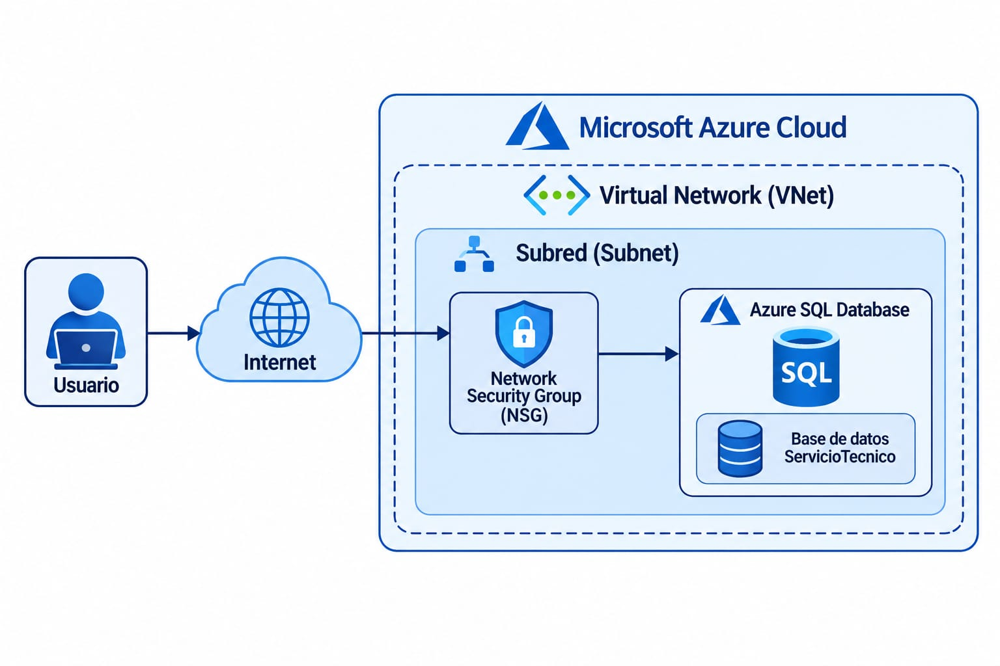

# Sección 15 | Arquitectura Cloud y Configuración de Instancia

## 1. Arquitectura de red en Microsoft Azure

La infraestructura cloud fue diseñada utilizando Microsoft Azure para alojar la base de datos mediante el servicio Azure SQL Database.

## Diagrama de arquitectura de red



```text
                Usuario
                   |
                Internet
                   |
            Microsoft Azure
                   |
             Red Virtual (VNet)
                   |
                Subred
                   |
        Grupo de Seguridad (NSG)
                   |
           Azure SQL Database
                   |
          Base de datos ServicioTecnico
