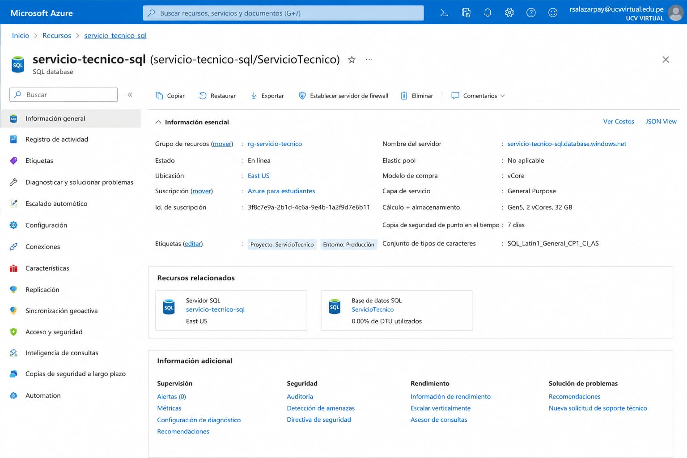
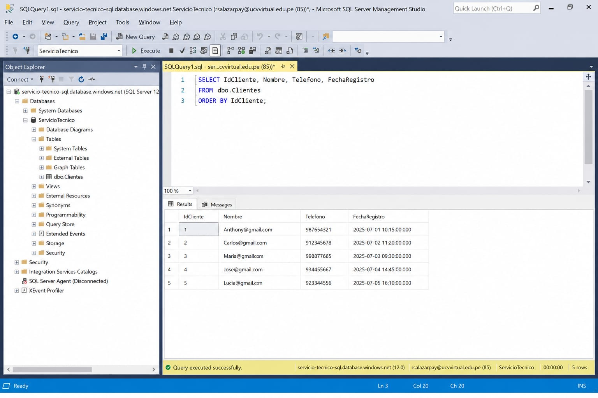
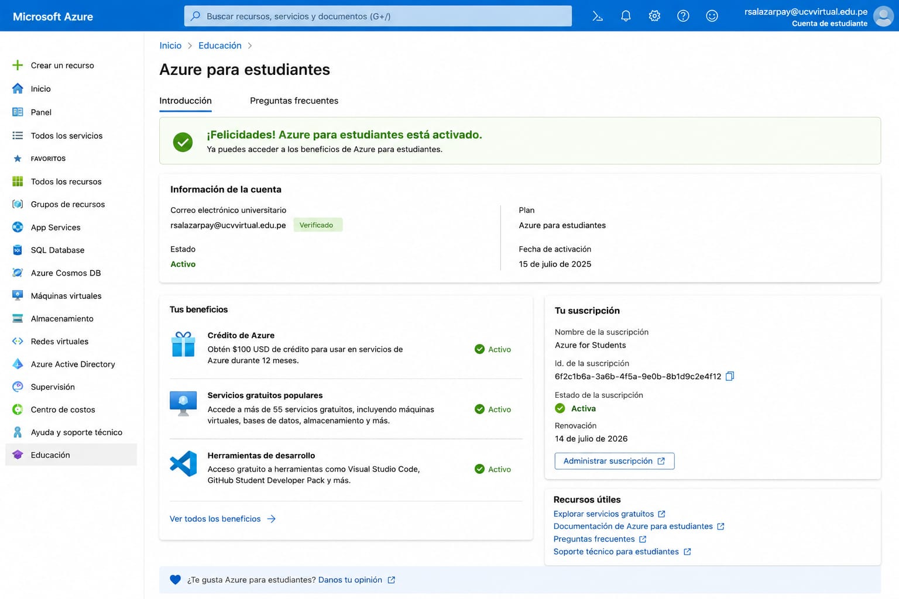

# Sección 15 | Arquitectura Cloud y Configuración de Instancia

## 1. Arquitectura de red en Microsoft Azure

La infraestructura cloud fue diseñada utilizando Microsoft Azure para alojar la base de datos mediante el servicio Azure SQL Database.

## Diagrama de arquitectura de red

                Usuario
                   |
                Internet
                   |
            Microsoft Azure
                   |
             Red Virtual (VNet)
                   |
                Subred
                   |
        Grupo de Seguridad (NSG)
                   |
           Azure SQL Database
                   |
          Base de datos ServicioTecnico

## 2. Configuración de la instancia Cloud

La instancia fue configurada utilizando Azure SQL Database para alojar la base de datos ServicioTecnico.

Configuración realizada:

- Servicio: Azure SQL Database.
- Motor: Microsoft SQL Server.
- Base de datos: ServicioTecnico.
- Método de autenticación: SQL Authentication.
- Seguridad: Reglas de Firewall de Azure.
- Acceso remoto: Habilitado para conexión externa.

## 3. Validación de conectividad remota

Se realizó la conexión remota hacia la instancia Azure SQL Database mediante SQL Server Management Studio (SSMS).

## 4. Activación de Azure for Students

La cuenta Azure for Students fue activada utilizando el correo universitario para acceder a los servicios educativos de Microsoft Azure.

